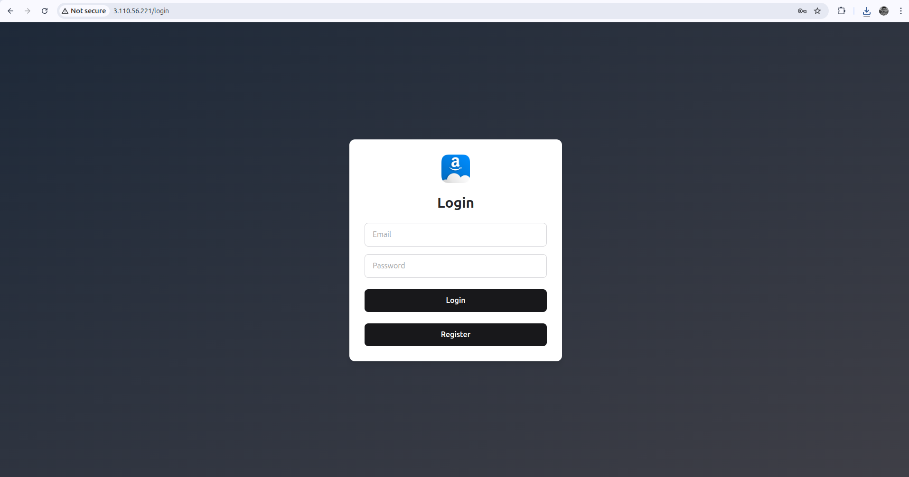
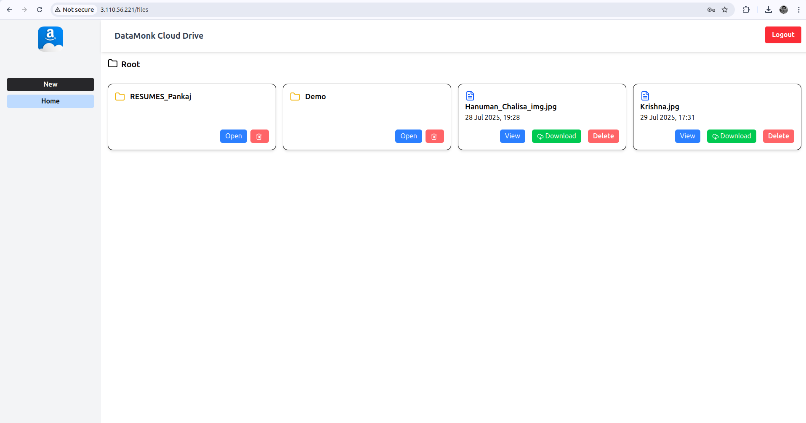
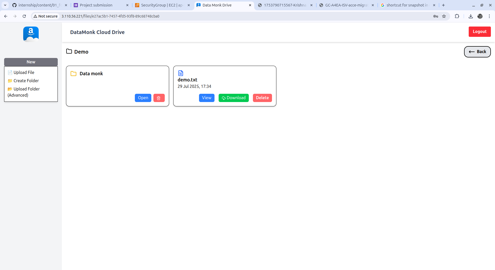
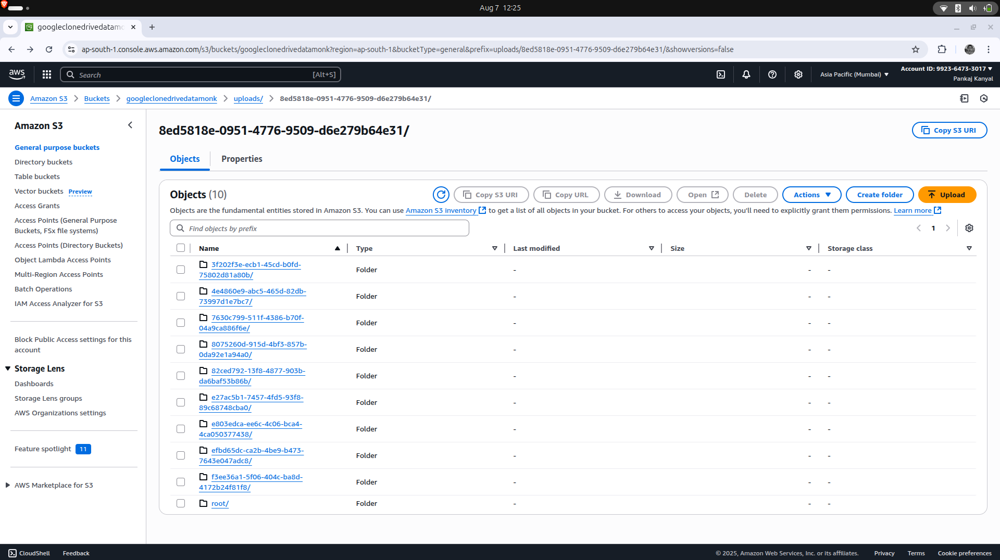

### Custom-Drive-AWS

<p> The Project is build as a part of DataMonk Internship. </p>
<p> Frontend is in REACTjs and Backend is in Nodejs</p>
<p> Prisma is used to talk with the sqlite3 database and create schema</p>


**KEY FEATURES**
1. Upload Files/Folders
2. View Files/Folders
3. Download Files
4. Delte Files/Folders
5. Login and Logout
6. Secure Endpoints(jwt and secure auth context)
7. Dockerization file avaliable to quick deploy the project.
8. Deployed in EC2 instance and with S3 Bucket


**.env structure**
```
# frontend
VITE_API_BASE=http://localhost:3000/api

# backend
PORT=3000
JWT_SECRET=********************
JWT_EXPIRES_IN=****************
AWS_ACCESS_KEY_ID=*************
AWS_SECRET_ACCESS_KEY=*********
AWS_REGION=********************
AWS_BUCKET_NAME=***************
FRONTEND_URL=******************

```


### Application Images
<h4>Login Screen</h4>


<h4>Dashboard</h4>


<h4>Upload Features</h4>


<h4>AWS S3 Bucket Uploads</h4>
